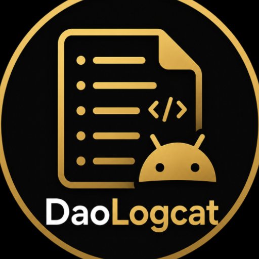
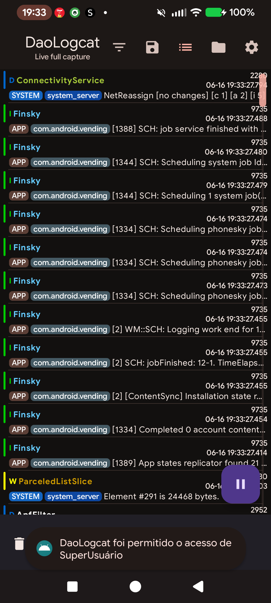
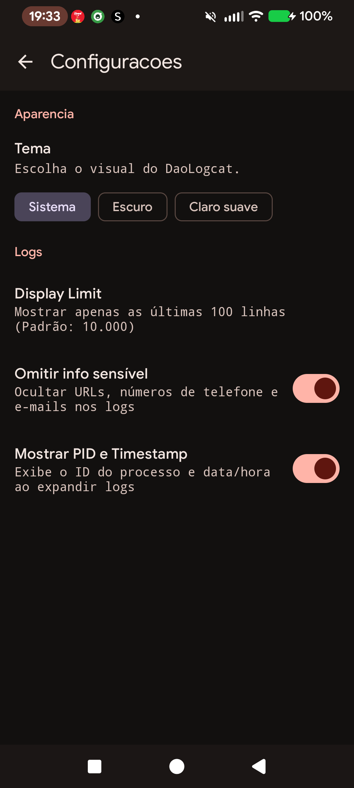
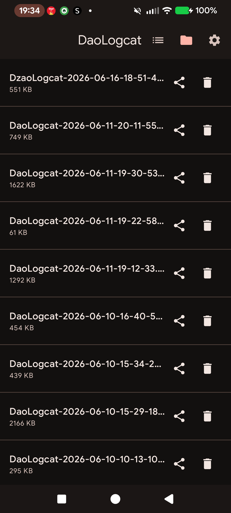

# DaoLogcat

DaoLogcat is a modern Android logcat reader focused on rooted devices, full-buffer capture, fast filtering, saved logs and a Material 3 / Jetpack Compose interface.

## Screenshots

  
  
  

## Features

- Root logcat capture across Android system buffers.
- Live log stream with pause, clear, search and level filtering.
- Process, package and SELinux-oriented log hints.
- Saved log browser with open, share and delete actions.
- Configurable display limit for large captures.
- Optional sensitive-data scrubber for URLs, phone numbers and emails.
- Dynamic Material 3 theme support.

## Requirements

- Android 12 or newer.
- Root access for full system log visibility. Without root, Android only exposes logs available to the app itself.

## Usage

1. Install and open DaoLogcat.
2. Grant root access when prompted.
3. Use the top bar to switch between live logs, saved logs and settings.
4. Use search/filter controls to narrow noisy captures, then save or share the result when needed.

## License

DaoLogcat is distributed under the GNU GPL v3 license.
